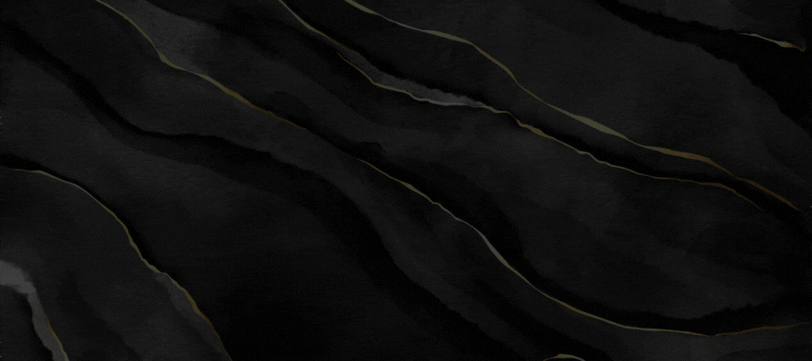
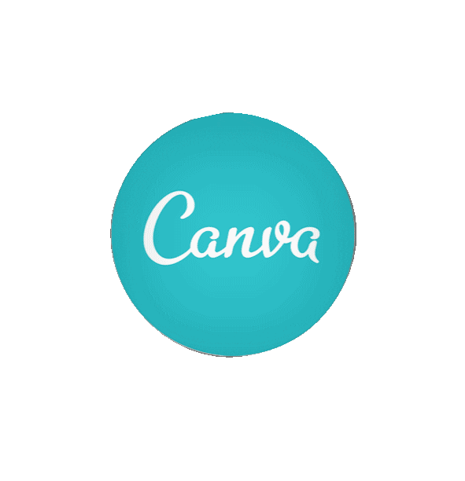
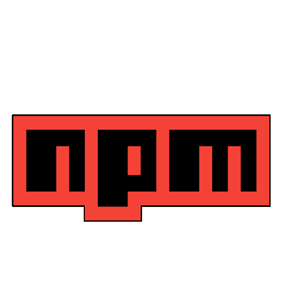

<!-- Header Image which is made in Canva -->

<!-- Centered Cartooned Giphy -->

 

<!-- Profile Visitors Count -->

  

<!-- About Me Section -->

<h1 align="center">💫 About Me 💫</h1>
<h3 align="center">

🔭 I’m currently working on **[Lighthouse](https://github.com/tantaana/light_house_client)** 

👯 I’m looking to collaborate on **[Promise Hospital](https://github.com/tantaana/promise_hospital_client)** 

🌱 I’m currently learning **Redux, React Native, PHP & Python** 

👨‍💻 All of my projects are available at **[My Portfolio](https://stanvir-portfolio.netlify.app)** 

📄 Know about my experiences from **[My Resume](https://drive.google.com/file/d/1tPGE-x4t1mMWQdwUHf4lqIQF053tDbqY/view)** 

📫 To reach me ➡️ **shariartanvir99@gmail.com** 

⚡ My fun fact is **I walk around when I can't solve programming related problem** 😂

</h3>   

<!-- Connect With Me Section -->

<h1 align="center">📩 Connect With Me 📩</h1>

<!-- --------------- -->

<!-- --------------- -->

<!-- --------------- -->

<!-- --------------- -->

<!-- --------------- -->

<!-- --------------- -->

   

<!-- Tech Stack Section -->

<h1 align="center">🖥️ Tech Stack 🖥️</h1>
<!-- --------------------- -->

<h2>Expertise:</h2>

<!-- ------------------------- -->

<h2>Familiar:</h2>

<!-- ------------------------- -->

<h2>Tools:</h2>

   

<!-- Github Stats Section -->

<h1 align="center">📉 Github Stats 📉</h1>

 
 

   

<!-- Github Trophies Section -->
<h1 align="center">🏆 Github Trophiess 🏆</h1>

   

<!-- Top Contributed Repo Section -->
<h1 align="center">✨ Top Contributed Repo ✨</h1>

   

<!-- Random Dev Quote Section -->
<h1 align="center">🕯️ Quote Of The Day 🕯️</h1>

